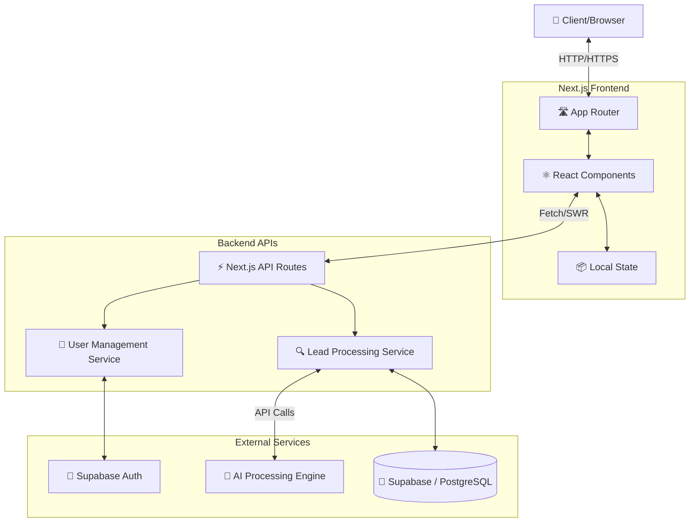
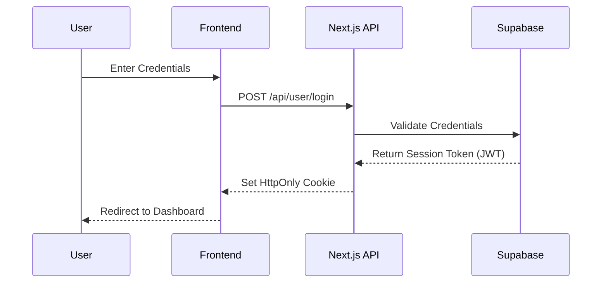
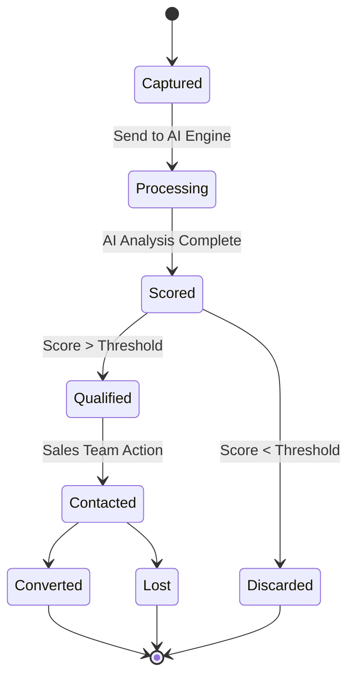

<div align="center">

# 🚀 Lead-Gen AI

**Next-Generation AI-Powered Lead Generation Platform**

[](https://nextjs.org/)
[](https://supabase.com/)
[](https://www.typescriptlang.org/)
[](https://opensource.org/licenses/MIT)

An intelligent, modern platform designed to revolutionize lead capture, management, and conversion using AI. Built with cutting-edge web technologies to ensure performance, scalability, and an exceptional user experience.

[Features](#-key-features) • [Architecture](#-system-architecture) • [Installation](#-getting-started) • [Contributing](#-contributing)

</div>

---

## ✨ Key Features

- 🧠 **AI-Powered Insights:** Leverage artificial intelligence to analyze, score, and predict high-quality leads.
- 🔐 **Secure Authentication:** Robust user authentication and session management powered by Supabase.
- ⚡ **Blazing Fast UI:** Server-side rendered pages and optimized client components using Next.js App Router.
- 📊 **Lead Management Dashboard:** Comprehensive overview and management interface for your captured leads.
- 🎨 **Modern Design:** Clean, accessible, and responsive user interface with Lucide icons and modular CSS.

---

## 🏗 System Architecture

The application follows a modern decoupled architecture utilizing Server Actions, edge API routes, and a managed PostgreSQL database.

### High-Level Architecture Diagram



### Authentication Flow



### Lead Capture Lifecycle



---

## 🚀 Getting Started

Follow these instructions to set up the project locally.

### Prerequisites

- Node.js 18.x or later
- npm, yarn, pnpm, or bun
- Supabase Project (Database URL & Anon Key)

### Installation

1. **Clone the repository**
   ```bash
   git clone https://github.com/amribrahim11vv/Lead-Gen--Ai.git
   cd Lead-Gen--Ai
   ```

2. **Install dependencies**
   ```bash
   npm install
   # or yarn install / pnpm install
   ```

3. **Environment Setup**
   Create a `.env.local` file in the root directory and add your Supabase credentials:
   ```env
   NEXT_PUBLIC_SUPABASE_URL=your_supabase_url
   NEXT_PUBLIC_SUPABASE_ANON_KEY=your_supabase_anon_key
   ```

4. **Run the development server**
   ```bash
   npm run dev
   ```

5. Open [http://localhost:3000](http://localhost:3000) in your browser to view the application.

---

## 📁 Project Structure

```text
Lead-Gen--Ai/
├── public/                 # Static assets (SVGs, images)
├── src/
│   ├── app/                # Next.js App Router pages and layouts
│   │   ├── api/            # Backend API route handlers (leads, user)
│   │   ├── auth/           # Authentication callbacks
│   │   └── login/          # Login page and components
│   ├── core/               # Core business logic and types
│   ├── lib/                # Shared utilities and helpers
│   ├── services/           # External service integrations (AI, Email)
│   ├── supabase/           # Supabase client configurations and types
│   └── ui/                 # Reusable UI components
├── .env.local.example      # Example environment variables
├── package.json            # Project dependencies and scripts
└── tsconfig.json           # TypeScript configuration
```

---

## 🤝 Contributing

Contributions are what make the open source community such an amazing place to learn, inspire, and create. Any contributions you make are **greatly appreciated**.

1. Fork the Project
2. Create your Feature Branch (`git checkout -b feature/AmazingFeature`)
3. Commit your Changes (`git commit -m 'Add some AmazingFeature'`)
4. Push to the Branch (`git push origin feature/AmazingFeature`)
5. Open a Pull Request

---

<div align="center">
Made with ❤️ by Amr Ibrahim
</div>
